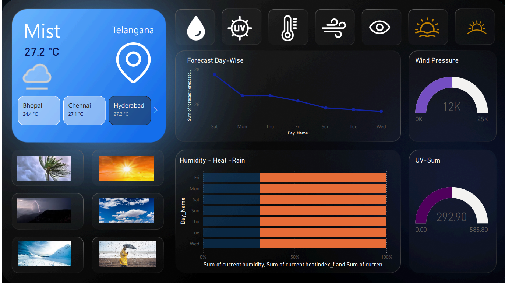

# 🌦 Weather Dashboard – Power BI

An interactive Weather Dashboard built using **Power BI** that displays real-time weather insights with a clean dark-themed UI.

---

## 📌 Project Overview

This dashboard provides:

- 🌡 Current Temperature
- ☁ Weather Condition
- 💨 Wind Speed
- 💧 Humidity
- 🌤 UV Index
- 📅 7-Day Forecast (Tile View)
- 🖼 Dynamic Weather Icons
- 🏙 City-Based Filtering

The report is designed with a modern card-based layout for better visualization and user experience.

---

## 🛠 Tools & Technologies Used

- Microsoft Power BI Desktop
- DAX (Data Analysis Expressions)
- Power Query
- OpenWeather API
- Custom Image URL Integration
- Conditional Formatting

---

## 🎨 Dashboard Features

### 🔹 1. Current Weather Summary
Displays key metrics using styled card visuals:
- Temperature
- Weather Type
- Wind Speed
- Humidity
- UV Index

### 🔹 2. 7-Day Forecast Grid
Forecast values displayed in uniform tiles:
- Dynamic weather icons
- Daily temperature
- Clean spacing and alignment

### 🔹 3. Dynamic Icons
Weather icons change automatically based on:
- Clear
- Rain
- Clouds
- Snow
- Thunderstorm
- Mist

Using image URL category in Power BI.

---

## 📊 Data Source

Weather data is fetched from:

**OpenWeather API**

📂 Dataset Files Used

✔ Download/Uploaded in this project (from your Google Drive link):
https://drive.google.com/drive/folders/1D_J7NSruksjQFGe7l92ZoAx0OnCnQzJC

- 📡 Weather API Details

This project uses the WeatherAPI REST endpoint to import weather data.
API Explorer: https://www.weatherapi.com/api-explorer.aspx

---

## 📷 Dashboard Preview

